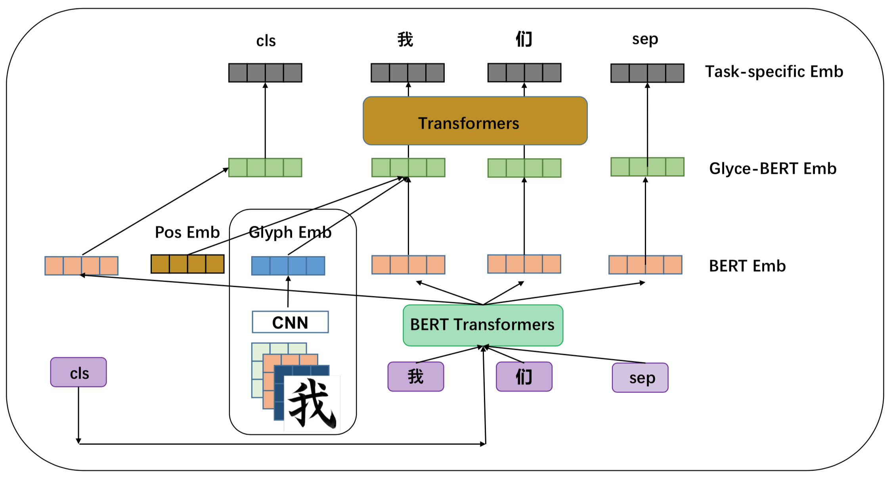

# Chinese Character Component Reading List

| Content                   |
| ------------------------- |
| 1. [Abstract](##Abstract)       |
| 2. [Papers](##Papers)        |
| 3. [Blogs](##Blogs)       |

## Abstract

汉字不同于其他表音性的文字，其表义的特殊性质为中文词语的分布式表示提供了另外的可能。其中，部件，作为具有组配汉字功能的构字单位，其具有的表义能力又成为汉语字、词级别的嵌入不可忽视的要素。以下文章主要从部件、字、词表示几个角度出发，到分词、词性标注等基础任务，再到文本分类、机器翻译等下游任务，以时间为序，梳理了汉字部件相关的向量表示及具体应用方面的最新研究成果。

## Papers

- 梁诗尘, 唐雪梅, 胡韧奋, 吴金闪, 刘智颖. [基于分布式表示的汉字部件表义能力测量与应用](http://cips-cl.org/static/anthology/CCL-2019/CCL-19-083.pdf). *In Proceedings of CCL 2019*. 
- Yuxian Meng, Wei Wu, Fei Wang, Xiaoya Li, Ping Nie, Fan Yin, Muyu Li, Qinghong Han, Xiaofei Sun and Jiwei Li. [Glyce: Glyph-vectors for Chinese Character Representations](https://arxiv.org/pdf/1901.10125.pdf). *In Proceedings of NeurIPS 2019*. \[[code](https://github.com/ShannonAI/glyce)].
- Shaosheng Cao, Wei Lu, Jun Zhou and Xiaolong Li. [cw2vec: Learning Chinese Word Embeddings with Stroke n-gram Information](https://aaai.org/ocs/index.php/AAAI/AAAI18/paper/view/17444/16786). *In Proceedings of AAAI 2018*. \[[code](https://github.com/bamtercelboo/cw2vec)].
- Nikola I. Nikolv, Yuhuang Hu, Mi Xue Tan and Richard H.R. Hahnloser. [Character-level Chinese-English Translation through ASCII Encoding](https://www.aclweb.org/anthology/W18-6302). *In Proceedings of WMT 2018*. \[[code](https://github.com/duguyue100/wmt-en2wubi)].
- Frederick Liu, Han Lu, Chieh Lo and Graham Neubig. [Learning Character-level Compositionality with Visual Features](https://arxiv.org/pdf/1704.04859). *In Proceedings of ACL 2017*. \[[code](https://github.com/frederick0329/Learning-Character-Level)].
- Falcon Z. Dai and Zheng Cai. [Glyph-aware Embedding of Chinese Characters](https://www.aclweb.org/anthology/W17-4109). *In Proceedings of EMNLP 2017*. \[[code](https://github.com/falcondai/chinese-char-lms)].
- Tzu-Ray Su and Hung-Yi Lee. [Learning Chinese Word Representations From Glyphs Of Characters](Learning Chinese Word Representations From Glyphs Of Characters). *In Proceedings of EMNLP 2017*. \[[code](https://github.com/HKUST-KnowComp/JWE)]
- Jinxing Yu, Xun Jian, Hao Xin and Yangqiu Song. [Joint Embeddings of Chinese Words, Characters, and Fine-grained Subcharacter Components](https://www.aclweb.org/anthology/D17-1027). *In Proceedings of EMNLP 2017*. \[[code](https://github.com/HKUST-KnowComp/JWE)].
- Yan Shao, Christian Hardmeier, Jorg Tiedemann and Joakim Nivre. [Character-based Joint Segmentation and POS Tagging for Chinese using Bidirectional RNN-CRF](https://www.aclweb.org/anthology/I17-1018). *In Proceedings of IJCNLP 2017*.
- Xiang Zhang and Yann LeCun. [Which Encoding is the Best for Text Classification in Chinese, English, Japanese and Korean?](Which Encoding is the Best for Text Classification in Chinese, English, Japanese and Korean?). *arXiv:1708.02657*. \[[code](https://github.com/zhangxiangxiao/glyph)].
- Rongchao Yin, Quan Wang, Rui Li, Peng Li and Bin Wang. [Multi-Granularity Chinese Word Embedding](https://www.aclweb.org/anthology/D16-1100). *In Proceedings of EMNLP 2016 (short)*.
- Xinlei Shi, Junjie Zhai, Xudong Yang, Zehua Xie and Chao Liu. [Radical Embedding: Delving Deeper to Chinese Radicals](https://www.aclweb.org/anthology/P15-2098). *In Proceedings of IJCNLP 2015 (short)*.
- Yanran Li, Wenjie Li, Fei Sun and Sujian Li. [Component-Enhanced Chinese Character Embeddings](http://www.emnlp2015.org/proceedings/EMNLP/pdf/EMNLP098.pdf). *In Proceedings of EMNLP 2015 (short)*.
- Yaming Sun, Lei Lin, Duyu Tang, Nan Yang, Zhenzhou Ji and Xiaolong Wang. [Radical-Enhanced Chinese Character Embedding](https://arxiv.org/pdf/1404.4714.pdf). *In Proceedings of ICONIP 2014*.

## Blogs

- [中文词向量论文综述（系列）](https://bamtercelboo.github.io/2018/08/16/chinese_embedding_paper_finished/)
- [cw2vec理论及其实现](https://bamtercelboo.github.io/2018/05/11/cw2vec/) 
- [汉字结构地图和汉语字词的矢量表示](http://www.bigphysics.org/index.php?title=分类:汉字结构地图和汉语字词的矢量表示&mobileaction=toggle_view_desktop)
